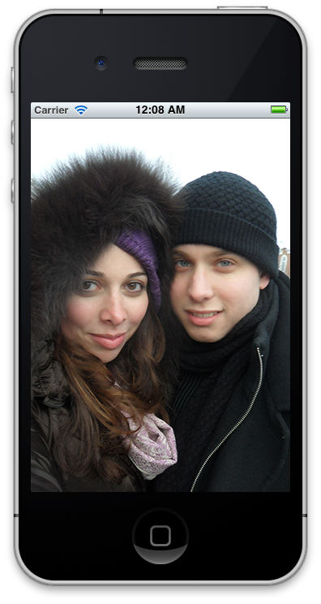
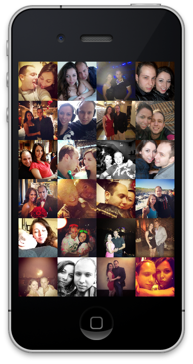
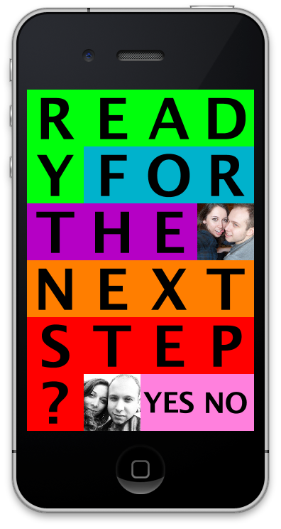
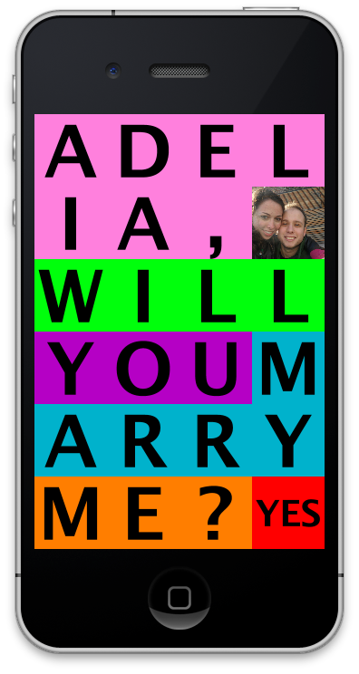
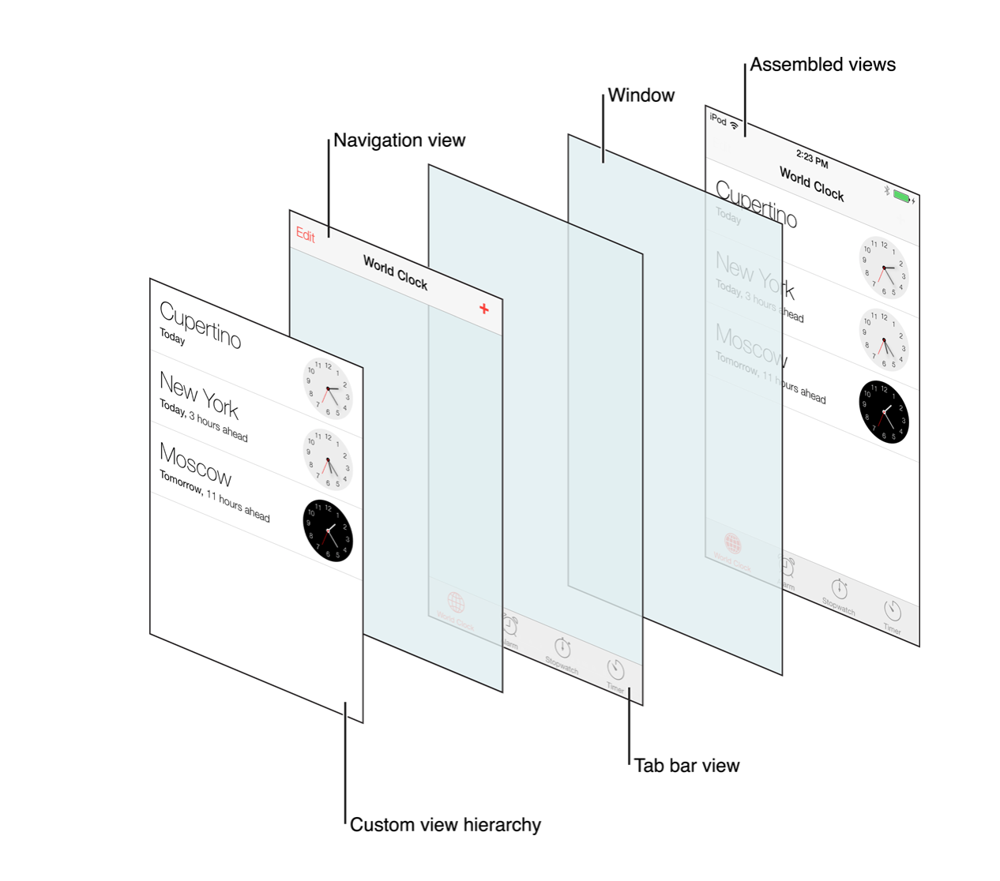
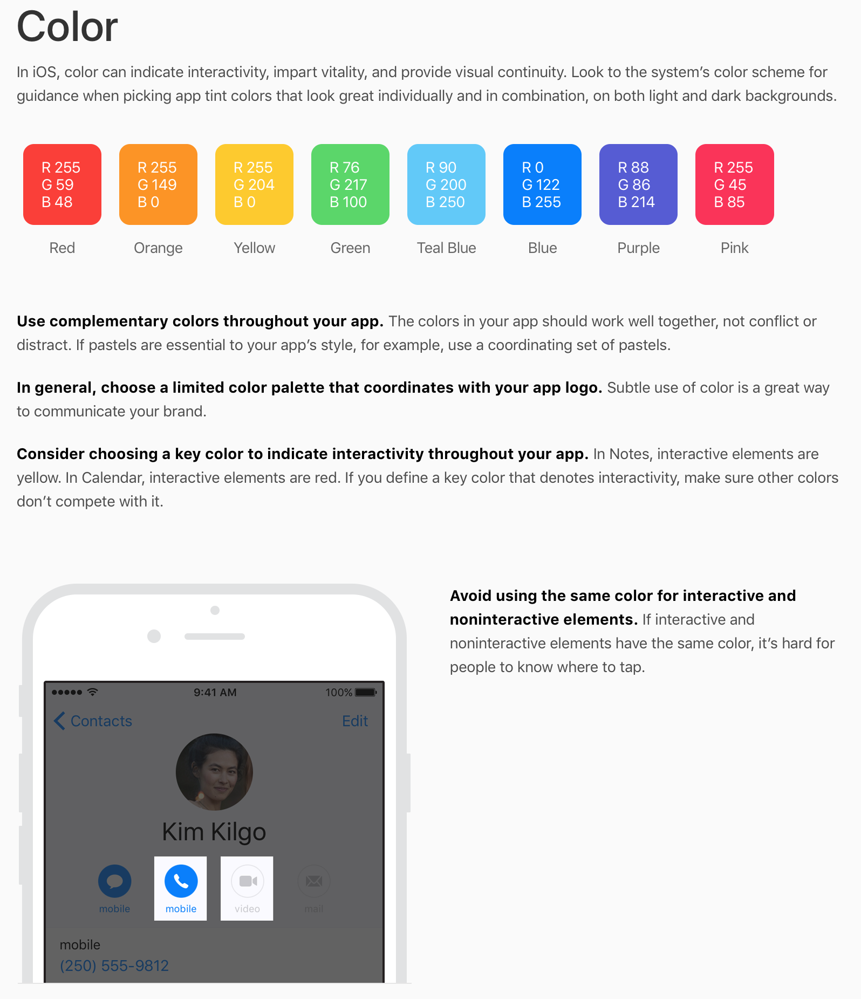
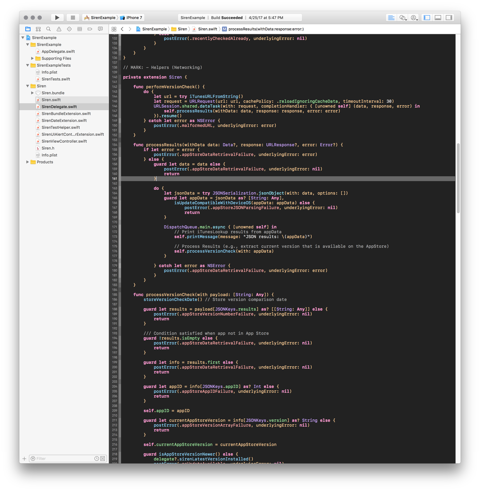
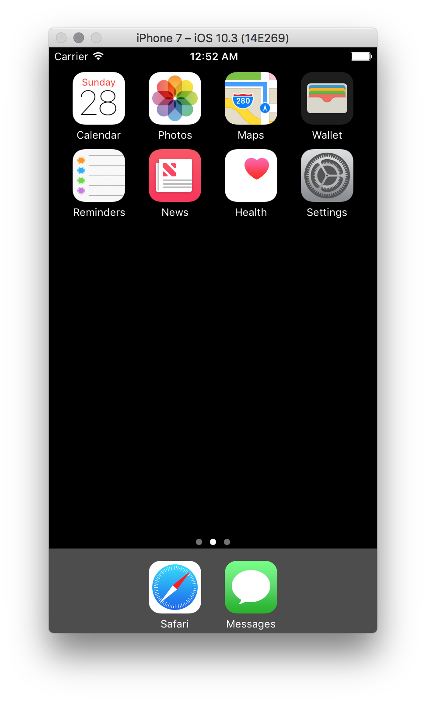
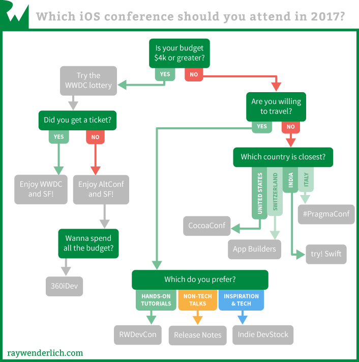

footer: © 2017, Arthur Ariel Sabintsev.
autoscale: true
slidenumbers: true

<!-- BEGIN TALK -->

## [fit] Introduction to Swift 3.1 and Xcode

### Presented at Learn Swift NOVA on July 15, 2017

---

# Background

**Present**
- Lead Developer, *The Washington Post*
- Freelance, *The iOS Consultant*
- Teacher, *Betamore & General Assembly*

**Past**
- Experimental Nuclear Physics, MS
- Biological Physics, BS
- Firefox Add-Ons Developer

---

# App Proposal

#### I proposed to my wife with an app in 2012. We were married in 2013. The [New York Times](https://nytimes.com) published a couple[^1] pieces[^2] on it.

   

[^1]: [Proposals (NYT)](http://www.nytimes.com/slideshow/2014/02/09/fashion/20140209-WEDDINGALBUM/s/20140209-WEDDINGALBUM-slide-QBA4.html)

[^2]: [Proposals that aren't Prosaic (NYT)](https://www.nytimes.com/2014/12/21/fashion/weddings/proposals-that-arent-prosaic.html)

---

<!-- THE ESSENTIALS SECTION -->
# The Essentials

---

# Hardware

**Initial investment is expensive!**

- **Computer**
 - Macbook Air, Macbook Pro, iMac: $999+
- **Testing Devices**
 - iPhone: $399+ (without subsidies)
 - iPad (WiFi-only): $329+
 - Apple Watch: $269+
 - Apple TV: $149+

---

# Software - Apple Developer Account[^3]

- **Free account**
  - Use your existing iCloud account.
- **Ship app to the App Store**
 - $99 personal or corporate account.
- **Ship app outside the App Store**
 - $299 enterprise account.

[^3]: [Apple Developer Center](https://developer.apple.com)

---

# Software - Xcode[^4]

 - **Integrated Development Environment (IDE)**
  - Code Editor, Compiler, Debugger, etc.
 - Includes Simulator and Testing tools

^
More on Xcode later on.

[^4]: [Xcode Homepage](https://developer.apple.com/xcode)

---

# User Interface Catalog[^5]

- User interface elements are an app’s building blocks.

- **Views** (Viewable)
 - Labels, Tables, Alerts, Images, etc.
- **Controls** (Interactable)
 - Buttons, Sliders, Switches, etc.

[^5]: [UIKit User Interface Catalog Homepage](https://developer.apple.com/library/content/documentation/UserExperience/Conceptual/UIKitUICatalog/index.html#//apple_ref/doc/uid/TP40012857-UIView-SW1)

---

# Human Interface Guidelines (HIG)[^6]

- Design Recommendations
- Design Resources[^13]

[^6]: [iOS Human Interface Guidelines Homepage](https://developer.apple.com/ios/human-interface-guidelines/overview/design-principles/)

[^7]: [Design Resources for Photoshop and Sketch](https://developer.apple.com/ios/human-interface-guidelines/resources/)

---

# Summary

- Initial investment is $1,000+ for hardware.
- Create a free Apple Developer Account.
- Read the UIKit User Interface Catalog.
- Read The Human Interface Guidelines (HIG).

---

<!-- LEARN TO CODE -->
# Learn to Code

---

# Programming Languages (Native)
- **Two** languages to choose from:
 - Swift
 - Objective-C

- Which one should I choose?

^
- Swift is Open Source.
- Swift can be used on the server.
- Swift is more popular than Objective-C according to the TIOBE index.

---

> “Swift is a successor to the C and Objective-C languages.”
~ Apple

---

# Learning Swift

- Everyone Can Code Series by Apple[^8]
 - Intro to App Development w/Swift[^9]
 - App Development with Swift
- Stanford's CS193P on iTunesU[^10]

[^8]: [Everyone Can Code Series on iBooks](https://itunes.apple.com/us/author/apple-education/id939801385?mt=11)

[^9]: [Intro to App Development with Swift on iBooks](https://itunes.apple.com/us/book/intro-to-app-development-with-swift/id1118575552?mt=11)

[^10]: [CS193P on iTunes U](https://itunes.apple.com/us/course/developing-ios-10-apps-with-swift/id1198467120)

---

# Programming Languages (Hybrid)
Apps can also be built using:
- **Web Languages (JavaScript + HTML + CSS)**
 - React Native, PhoneGap
- **C Sharp (C#)**
 - Xamarin
- **Ruby**
 - Ruby Motion

I cannot comment on the hybrid approach as it's not my forté.

---

## Stuck Programming?

- Stack Overflow[^11]
 - Have a problem? Ask here! Provide some sample code.
 - 99% chance that a similar problem has already been solved.
- Apple Developer Forums[^12]

[^11]: [Stack Overflow](https://www.stackoverflow.com)

[^12]: [Apple Developer Forums](https://forums.developer.apple.com/welcome)

---

# Your First App
## Remember Xcode? :wink:

- Write Code
- Test Code
- Debug Code
- Submit Apps to App Store
- Also, Playgrounds![^13]

[^13]: [Swift Playgrounds for iPad and Xcode](https://www.apple.com/swift/playgrounds/)

---

# The iOS Simulator[^14]

- Simulate all devices on your computer:
 - iPhone
 - iPad
 - Apple Watch
 - Apple TV
- Simulate Location, Notifications, Connectivity Issues, etc.

[^14]: Bundled with Xcode

---

# Summary

- Learn Swift for free from Apple or Stanford.
- Use Swift to build your apps.
- If you get stuck, ask Stack Overflow for help.
- Use Xcode to write, test, and deploy your apps.

---

<!-- iOS COMMUNITY SECTION -->
# The iOS Community

---

# Worldwide Developers Conference (WWDC)
## Part 1 of 2

- **Every June, Apple holds a conference in California.**
  - 5000+ Developers invited via lottery
  - 1000 Apple Engineers
- **Announcements**
 - New versions of iOS, macOS, watchOS, and tvOS.
 - Occasionally, hardware refreshes.

---

# Worldwide Developers Conference (WWDC)
## Part 2 of 2

- **200+ Lectures/Talks**
 - Weeklong event unveiling forthcoming improvements for developers in iOS, macOS, etc.
- **Livestreams**
  - Keynote is livestreamed.
  - Some talks are livestreamed.
  - Video and PDF transcripts made available after each talk.
- **Assistance from Apple Engineers**
  - 1-on-1 Design Meetings.
  - Code assistance from the engineers building the APIs.

---

# Other Conferences[^15]

- [360|iDev](https://360idev.com) - Indy Development
- [AltConf](altconf) - Free
- [App Builders](https://appbuilders.ch) - Switzerland
- [CocoaConf](http://cocoaconf.com) - Traveling Conference w/Tutorials
- [FrenchKit](http://frenchkit.fr) - France
- [iOSDevCampDC](https://iosdevcampdc.com) - Technical Conference at Capital One in Virginia
- [iOSDevUK](http://www.iosdevuk.com) - Held at a University in the UK
- [Pragma Conference](https://pragmaconference.com) - Italy
- [Release Notes](https://2017.releasenotes.tv) - Business of App Development in Chicago
- [RWDevCon](https://www.rwdevcon.com) - Hands on Tutorials
- [SwiftAlps](http://theswiftalps.com) - Switzerland
- [SwiftSummit](http://www.swiftsummit.com) - San Francisco
- [try! Swift](https://www.tryswift.co) - Traveling Conference
- [UIKonf](http://www.uikonf.com) - Berlin

[^15]: [Ray Wenderlich: Top 10 iOS Conferences](https://www.raywenderlich.com/149517/top-10-ios-conferences-2017)

---

# Local Meetups (DC, MD, VA)

- [Baltimore iOS Development Meetup](https://www.meetup.com/Baltimore-iOS-Development-Meetup/)
- [CocoaHeads DC](http://cocoaheadsdc.org)
- [Columbia iOS Development Meetup](https://www.meetup.com/Columbia-iOS-Development-Meetup/)
- [ModevDC](https://www.meetup.com/modevdc/)

---

# Podcasts
- [Core Intuition](http://www.coreint.org) - Indy Development
- [Release Notes](https://releasenotes.tv) - Indy Development
- [Runtime](https://spec.fm/podcasts/runtime) - General iOS & Swift Development
- [SwiftCoders](https://swiftcoders.podbean.com) - Interview with Swift Developers
- [Swift Unwrapped](https://spec.fm/podcasts/swift-unwrapped) - Deep-dive into Swift language development
- [Under the Radar](https://www.relay.fm/radar) - Indy Development

---

<!-- DEMO SECTION -->
# Demo
